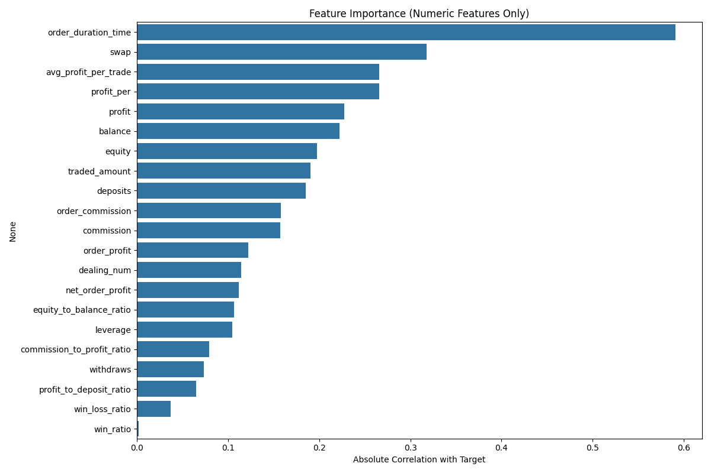
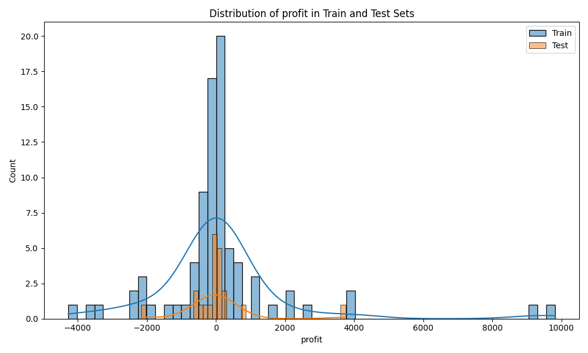
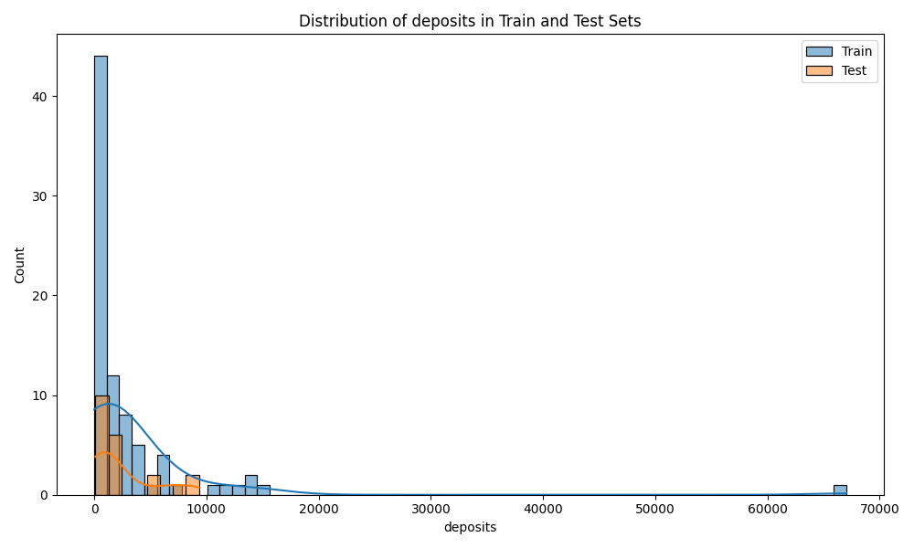
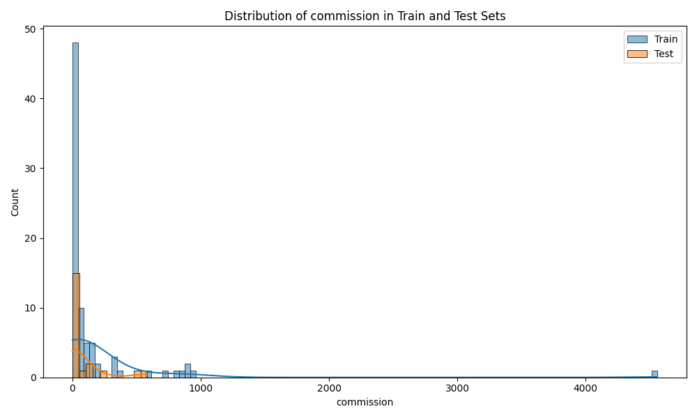
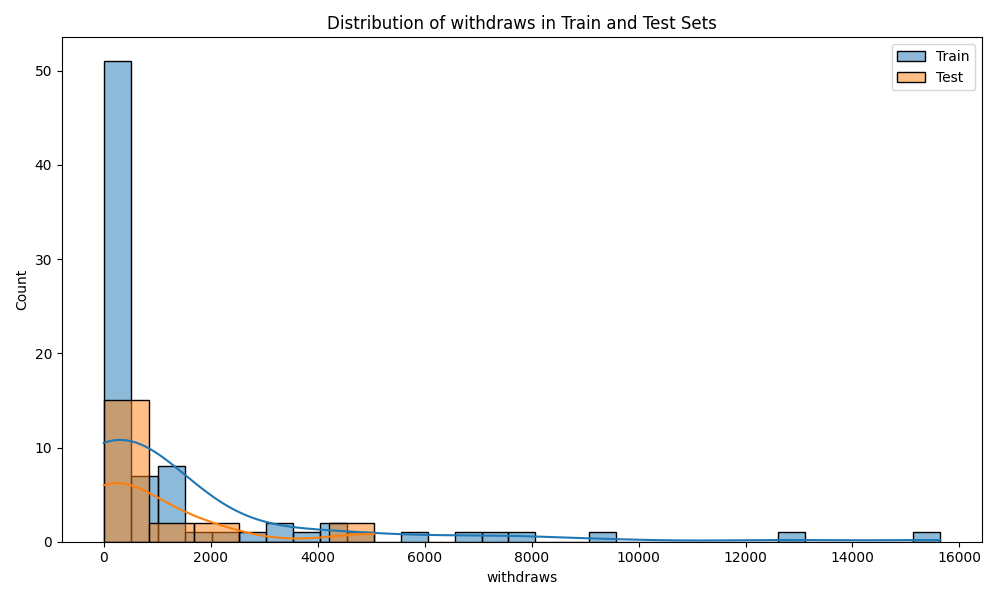
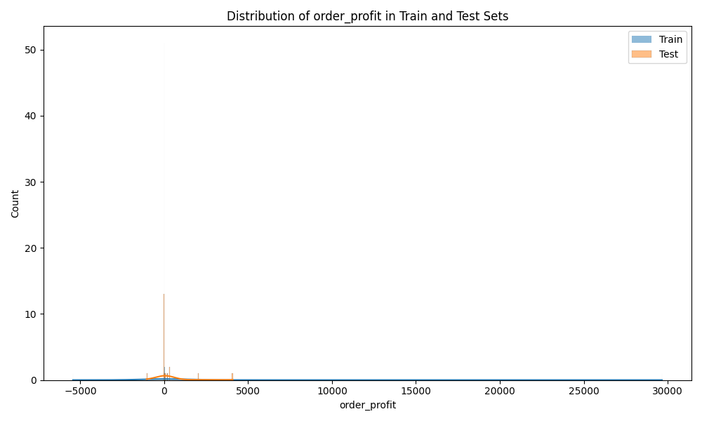

# LLM-based Trading Account Classification Report
Generated on: 2024-09-23 19:23:51

## 1. Dataset Overview

- Total samples: 103
- Training samples: 82 (79.61%)
- Test samples: 21 (20.39%)
- Number of features: 18
- Number of numeric features: 15
- Number of categorical features: 3
- Number of classes: 2
- Class distribution: {1.0: 56, 0.0: 47}

## 2. Model Performance

| Metric | Value |
|--------|-------|
| Accuracy | 1.0000 |
| Precision | 1.0000 |
| Recall | 1.0000 |
| F1-score | 1.0000 |
| Cohen's Kappa | 1.0000 |
| Matthews Correlation Coefficient | 1.0000 |
| Balanced Accuracy Score | 1.0000 |

### Confusion Matrix

```
[[12  0]
 [ 0  9]]
```

### Classification Report

```
              precision    recall  f1-score   support

         0.0       1.00      1.00      1.00        12
         1.0       1.00      1.00      1.00         9

    accuracy                           1.00        21
   macro avg       1.00      1.00      1.00        21
weighted avg       1.00      1.00      1.00        21

```

## 3. Cross-Validation Results

- Cross-validation scores: [1.0, 0.9047619047619048, 1.0, 1.0, 0.8]
- Mean CV accuracy: 0.9410
- Standard deviation: 0.0795


Cross-validation results suggest the model's performance is consistent across different subsets of the data.

## 4. Feature Importance Analysis



Top 5 most important numeric features:
- order_duration_time: 0.5906
- swap: 0.3179
- avg_profit_per_trade: 0.2659
- profit_per: 0.2659
- profit: 0.2273

## 5. Distribution Comparison (Train vs Test)


### profit



### deposits



### commission



### withdraws



### order_profit




